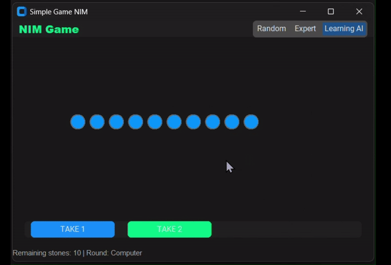

# NIM Game with AI and GUI

This is a graphical implementation of the simple NIM game using `customtkinter`. The game allows a human player to compete against an AI opponent, which can play in three different modes: **Random**, **Expert**, and **Learning AI** (using Q-Learning).

## Features
- **Graphical User Interface (GUI)** built with `customtkinter`.
- **Three Modes:**
  - **Random:** The AI selects a move randomly.
  - **Expert:** The AI plays optimally using a mathematical strategy.
  - **Learning AI:** The AI learns over time using Q-Learning.
- **Animated Game Elements**: The stones are visually displayed and updated dynamically.
- **Victory Message**: Displays a pop-up when the game ends.

## Installation
### Requirements
Make sure you have Python installed, then install the required dependencies:
```bash
pip install customtkinter numpy
```

## How to Play
1. Run the game:
   ```bash
   python nim_game.py
   ```
2. Select a mode from the top menu (**Random, Expert, or Learning AI**).
3. Click on **"TAKE 1"** or **"TAKE 2"** to remove stones from the pile.
4. The game continues until no stones remain.
5. The player who makes the last move **wins**.
6. A victory pop-up appears announcing the winner.

## Modes Explained
- **Random:** Chooses moves randomly.
- **Expert:** Uses a deterministic strategy based on modulo arithmetic.
- **Learning AI:** Implements **Q-Learning** to improve its decision-making over time.

## Demo


## Author
Created by Isabelle Bricaud during AI MSc at the University of Kent.

